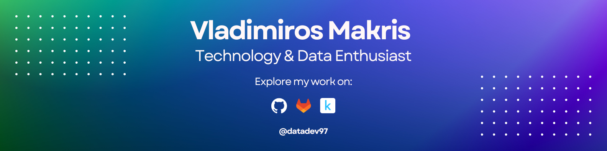

  

###

<h2 align="left">About me:</h2>

###

📊 Passionate about data science and software development, focusing on data-driven solutions. ğŸ› ï¸ Enjoy building scalable software that transforms raw data into valuable insights. 📈 Interested in machine learning, automation, and AI to enhance efficiency and innovation. 💡 Always exploring new technologies, frameworks, and best practices to improve solutions. 🔠Looking to collaborate on data-centric projects, research, and innovative applications. 🚀 Enthusiastic about problem-solving and optimizing workflows through smart technology.

###

<h2 align="left">I code with:</h2>

###

  
  
  
  
  
  
  
  
  
  
  
  
  
  
  
  
  
  
  
  
  

###
